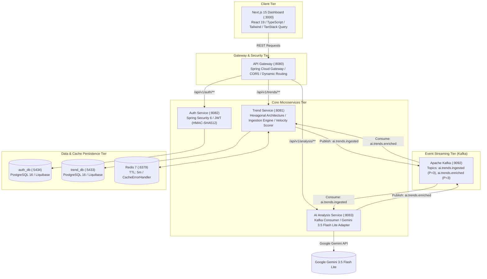
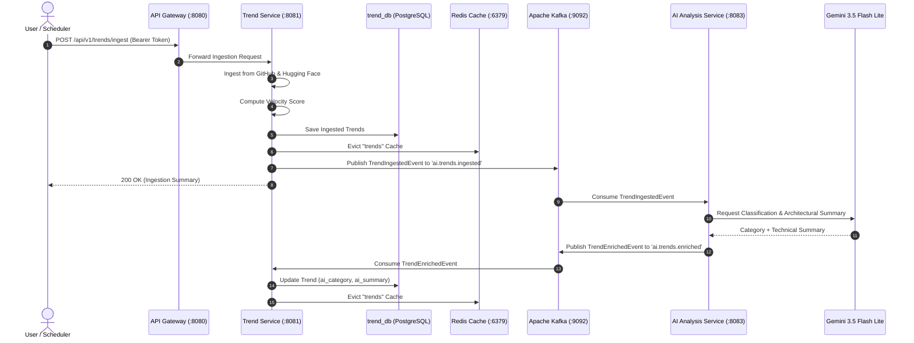
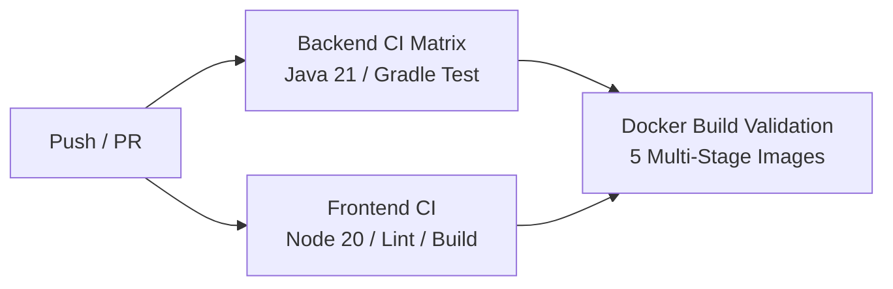

# 🚀 AI Trend Explorer

[](https://openjdk.org/projects/jdk/21/)
[](https://spring.io/projects/spring-boot)
[](https://nextjs.org/)
[](https://kafka.apache.org/)
[](https://redis.io/)
[](https://www.postgresql.org/)
[](https://ai.google.dev/)
[](https://www.docker.com/)
[](LICENSE)
[](https://github.com/Akshaysd592)

> **An enterprise-grade, event-driven microservices platform designed to discover, aggregate, score, and AI-enrich trending open-source AI repositories and models in real time.**

---

## 📑 Table of Contents

- [Overview](#-overview)
- [System Architecture](#-system-architecture)
- [Event-Driven Ingestion & AI Pipeline](#-event-driven-ingestion--ai-pipeline)
- [Hexagonal Architecture (Ports & Adapters)](#-hexagonal-architecture-ports--adapters)
- [Microservices Catalog & Port Matrix](#-microservices-catalog--port-matrix)
- [REST API Reference](#-rest-api-reference)
- [Key Features](#-key-features)
- [Quickstart Guide](#-quickstart-guide)
- [Environment Configuration Matrix](#-environment-configuration-matrix)
- [Testing & Quality Assurance](#-testing--quality-assurance)
- [CI/CD Pipeline](#-cicd-pipeline)
- [Author & Maintainer](#-author--maintainer)
- [License](#-license)

---

## 🌟 Overview

**AI Trend Explorer** solves the challenge of discovering high-impact AI models and developer tools across fragmented ecosystems. It continuously ingests data from **GitHub** and **Hugging Face**, scores their growth velocity, and leverages **Google Gemini 3.5 Flash Lite** over an asynchronous **Apache Kafka** event pipeline to generate architectural summaries and category classifications.

### Key Capabilities:
- **Event-Driven Reactive Pipeline**: Fully decoupled ingestion and AI enrichment using Apache Kafka.
- **Hexagonal Architecture**: Strict domain boundary separation with incoming and outgoing ports.
- **Smart AI Summaries**: Automated categorizations and architectural insights via Google Gemini AI (`gemini-3.5-flash-lite`).
- **Resilient Multi-Layer Caching**: Redis 7 caching with automated fallback to PostgreSQL on cache anomalies.
- **Modern Full-Stack UI**: Next.js 15 App Router, React 19, TypeScript, Tailwind CSS, TanStack Query, and Redux Toolkit.
- **Enterprise Security**: Stateless JWT authentication (HMAC-SHA512), role-based access control, and Spring Cloud Gateway routing.
- **1-Command Containerization**: Production multi-stage Dockerfiles orchestrated via Docker Compose.

---

## 🏗️ System Architecture



---

## 🔄 Event-Driven Ingestion & AI Pipeline



---

## 🔷 Hexagonal Architecture (Ports & Adapters)

Each backend service strictly adheres to **Hexagonal Architecture (Ports & Adapters)** principles to ensure zero business logic coupling with external frameworks:

```text
com.aitrend.trend/
├── domain/                     # Pure Business Logic & Domain Models (No framework annotations)
│   ├── model/                  # Trend, SourceType, IngestionResult
│   └── exception/              # TrendNotFoundException, DomainValidationException
├── application/                # Application Use Cases & Ports
│   ├── port/in/                # Inbound Ports (TrendUseCase, IngestTrendsUseCase, Commands/Queries)
│   ├── port/out/               # Outbound Ports (TrendRepositoryPort, IngestionSourcePort, EventPublisherPort)
│   └── service/                # Application Services orchestrating Use Cases
├── adapter/                    # Ports Implementations (Adapters)
│   ├── in/
│   │   ├── web/                # REST Controllers (OpenAPI Generated Specs)
│   │   └── kafka/              # Kafka Consumers (TrendEnrichedEventListener)
│   └── out/
│       ├── persistence/        # Spring Data JPA, Hibernate, PostgreSQL Entities
│       ├── ingestion/          # GitHub / Hugging Face WebClient Ingestion Adapters
│       ├── ai/                 # Gemini AI Adapter & RestClient
│       └── kafka/              # Kafka Producers (EventPublisherAdapter)
└── infrastructure/             # Cross-Cutting Infrastructure
    ├── config/                 # Redis, Kafka, Security, OpenAPI Bean Configurations
    └── exception/              # GlobalExceptionHandler, ProblemDetail RFC 7807
```

---

## 📊 Microservices Catalog & Port Matrix

| Service / Container | Internal Port | Host Port | Protocol | Health Endpoint | Description |
|---|---|---|---|---|---|
| **`frontend`** | `3000` | `3000` | HTTP | `GET /` | Next.js 15 Standalone Web Application |
| **`api-gateway`** | `8080` | `8080` | HTTP | `/actuator/health` | Spring Cloud Gateway (CORS, Routing, Rate Limiting) |
| **`trend-service`** | `8081` | `8081` | HTTP | `/actuator/health` | Hexagonal Trend Ingestion, Scoring, and Repository |
| **`auth-service`** | `8082` | `8082` | HTTP | `/actuator/health` | Spring Security 6, JWT Authentication & User Management |
| **`ai-analysis-service`** | `8083` | `8083` | HTTP | `/actuator/health` | Gemini 3.5 Flash Lite Kafka Consumer & AI Enrichment |
| **`kafka`** | `9092` | `9092` | TCP | Native Broker | Apache Kafka 3.7 Event Streaming Broker |
| **`redis`** | `6379` | `6379` | RESP | `redis-cli ping` | Redis 7 Distributed Cache with CacheErrorHandler |
| **`trend-postgres`** | `5432` | `5433` | PostgreSQL | `pg_isready` | PostgreSQL 16 Database for `trend_db` |
| **`auth-postgres`** | `5432` | `5434` | PostgreSQL | `pg_isready` | PostgreSQL 16 Database for `auth_db` |

---

## 📡 REST API Reference

### 1. Authentication Service (`/api/v1/auth`)

| Method | Endpoint | Auth | Request Body | Description |
|---|---|---|---|---|
| `POST` | `/api/v1/auth/register` | None | `{ "email", "password", "firstName", "lastName" }` | Register a new user account |
| `POST` | `/api/v1/auth/login` | None | `{ "email", "password" }` | Authenticate and obtain JWT access & refresh tokens |
| `GET` | `/api/v1/auth/me` | Bearer | — | Get authenticated user profile |

### 2. Trend Explorer Service (`/api/v1/trends`)

| Method | Endpoint | Auth | Query Parameters | Description |
|---|---|---|---|---|
| `GET` | `/api/v1/trends` | None | `source`, `language`, `q`, `page`, `size`, `sortBy`, `sortDir` | List paginated trends (Cached in Redis) |
| `GET` | `/api/v1/trends/{id}` | None | — | Retrieve single trend by ID |
| `POST` | `/api/v1/trends/ingest` | Bearer | — | Trigger ingestion from GitHub & Hugging Face |
| `PATCH`| `/api/v1/trends/{id}/ai-metadata` | Bearer | `{ "aiCategory", "aiSummary" }` | Update AI metadata for a trend |

### 3. AI Analysis Service (`/api/v1/analysis`)

| Method | Endpoint | Auth | Description |
|---|---|---|---|
| `POST` | `/api/v1/analysis/trend/{id}` | None | Trigger on-demand Gemini AI analysis for a specific trend |

---

## 🎯 Key Features

### 1. Next.js 15 Standalone Dashboard
- **Reactive UI**: Filter trends by source (`GITHUB`, `HUGGING_FACE`), programming language, keyword, and sorting (stars, velocity score, date).
- **Dedicated Details View (`/trends/[id]`)**: Full deep-dive page with velocity rank indicators, architectural analysis, topic clouds, and live AI re-analysis triggers.
- **State Management**: Redux Toolkit for UI preferences (view modes, active filters) combined with TanStack Query for server state caching.

### 2. Resilient Redis 7 Multi-Layer Caching
- Configured with `GenericJackson2JsonRedisSerializer` and `JavaTimeModule` for JSON serialization of domain records.
- **`CacheErrorHandler` Fallback**: If Redis becomes temporarily unreachable or suffers deserialization errors, requests automatically fall back to PostgreSQL without failing user calls.

### 3. Automated Gemini 3.5 Flash Lite Integration
- Uses Google's high-efficiency `models/gemini-3.5-flash-lite` model.
- Prompts engineered for deterministic, high-signal architectural summaries and standardized developer category tags.

---

## 🚀 Quickstart Guide

### Prerequisites
- [Docker & Docker Compose](https://docs.docker.com/get-docker/) (Docker Engine 24+ recommended)
- [Git](https://git-scm.com/)

### 1. Clone the Repository
```bash
git clone https://github.com/Akshaysd592/ai-trend-explorer.git
cd ai-trend-explorer
```

### 2. Configure Environment Variables
Copy `.env.example` to `.env` and provide your **Google Gemini API Key**:
```bash
cp .env.example .env
```
Edit `.env`:
```env
GEMINI_API_KEY=your_actual_gemini_api_key_here
JWT_SECRET=404E635266556A586E3272357538782F413F4428472B4B6250645367566B5970337336763979244226452948404D6351655468576D5A7134743777217A25432A
```

### 3. Start the Entire Distributed Stack
Run Docker Compose in detached mode:
```bash
docker compose up -d --build
```

### 4. Verify System Status
```bash
docker compose ps
```
All 9 containers should report `Up (healthy)`.

### 5. Access the Platform
- **Frontend Web UI**: [http://localhost:3000](http://localhost:3000)
- **API Gateway**: [http://localhost:8080](http://localhost:8080)
- **Trend Service OpenAPI Docs**: [http://localhost:8080/v3/api-docs/trends](http://localhost:8080/v3/api-docs/trends)

---

## ⚙️ Environment Configuration Matrix

| Variable Name | Default Value | Target Service | Description |
|---|---|---|---|
| `GEMINI_API_KEY` | — *(Required)* | `trend-service`, `ai-analysis-service` | Google Gemini API Key for LLM classification |
| `GEMINI_MODEL` | `models/gemini-3.5-flash-lite` | `trend-service`, `ai-analysis-service` | Selected Gemini model |
| `JWT_SECRET` | *(HMAC-SHA512 256-bit Key)* | `auth-service`, `trend-service` | Shared signing key for JWT token verification |
| `KAFKA_BOOTSTRAP_SERVERS` | `kafka:9092` | All Services | Kafka broker connection string |
| `REDIS_HOST` | `redis` | `trend-service` | Redis container host |
| `REDIS_PORT` | `6379` | `trend-service` | Redis connection port |
| `TREND_POSTGRES_DB` | `trend_db` | `trend-postgres`, `trend-service` | Trend database name |
| `AUTH_POSTGRES_DB` | `auth_db` | `auth-postgres`, `auth-service` | Auth database name |
| `NEXT_PUBLIC_API_URL` | `http://localhost:8080` | `frontend` | Gateway URL accessed by the browser |

---

## 🧪 Testing & Quality Assurance

### Run Backend Unit & Integration Tests
```bash
# Test all microservices
./gradlew test

# Or run tests for a specific service
./gradlew :trend-service:test
./gradlew :auth-service:test
./gradlew :ai-analysis-service:test
./gradlew :api-gateway:test
```

### Run Frontend Linting & Build Checks
```bash
cd frontend
npm ci
npm run lint
npm run build
```

---

## 🔁 CI/CD Pipeline

The project includes an enterprise **GitHub Actions** CI workflow (`.github/workflows/ci.yml`) that validates every Pull Request and commit to `main`:



- **Backend CI Matrix**: Parallel build and unit testing across all 4 Spring Boot microservices with Gradle build caching.
- **Frontend CI**: TypeScript verification, ESLint auditing, and Next.js standalone build generation.
- **Docker Validation**: Multi-stage image build checks for all services.

---

## 👨‍💻 Author & Maintainer

**Akshay**
- GitHub: [@Akshaysd592](https://github.com/Akshaysd592)
- Repository: [ai-trend-explorer](https://github.com/Akshaysd592/ai-trend-explorer)

---

## 📄 License

This project is licensed under the **MIT License** — Copyright © 2026 **Akshay** ([@Akshaysd592](https://github.com/Akshaysd592)).

See the full [LICENSE](LICENSE) file for terms of use and distribution permissions.
